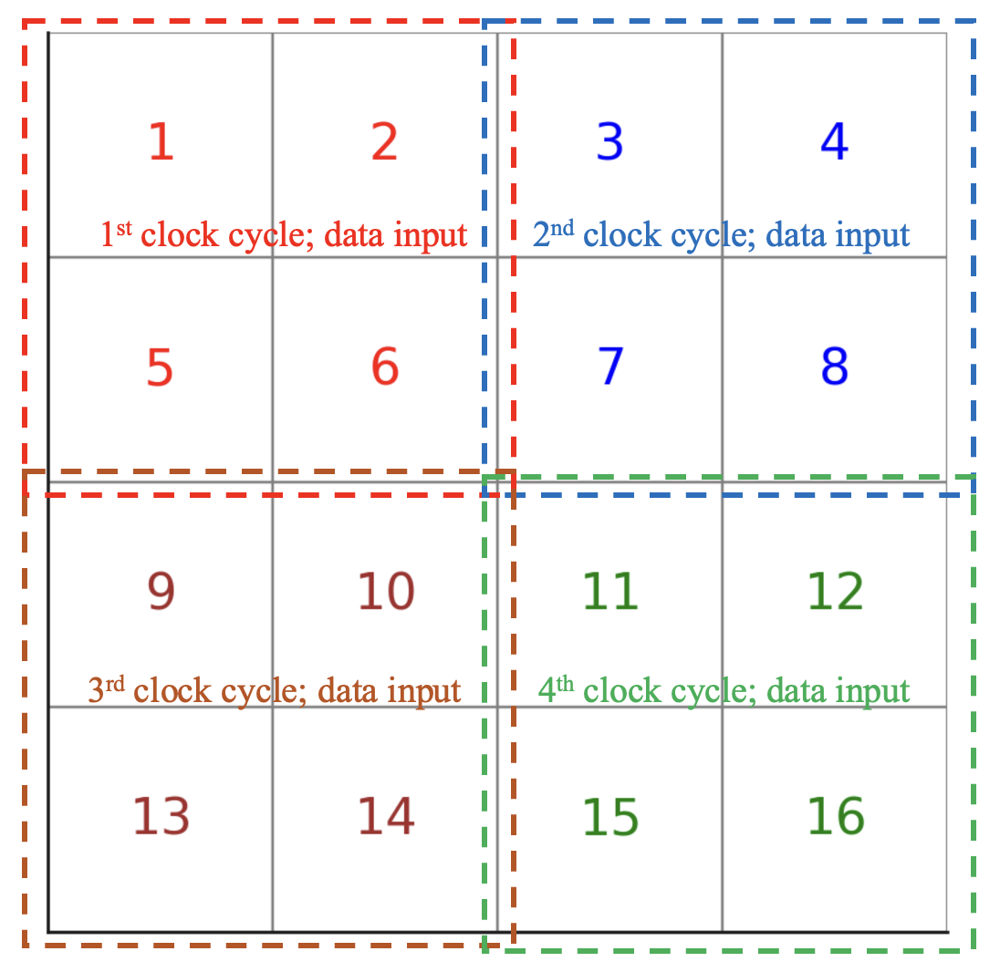
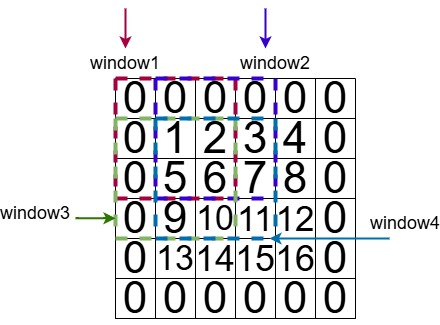

# CNN Accelerator: Hardware Methodology & Architecture

This repository contains a CNN accelerator implemented in SystemVerilog with an end-to-end automated design flow—from PyTorch model definition to synthesizable hardware—using the MASE Machine Learning compiler. The design is simulated using Verilator and verified with Cocotb.

## Table of Contents
- [Proposed Hardware Methodology](#proposed-hardware-methodology)
- [CNN Architecture Overview](#cnn-architecture-overview)
- [Padding Module](#padding-module)
- [Striding Module](#striding-module)
- [CNN Arithmetic Block](#cnn-arithmetic-block)
- [Getting Started](#getting-started)
- [Simulation Results](#simulation-results)

## Proposed Hardware Methodology

### Choice of Simulator
- **Design Implementation:** Developed in SystemVerilog.
- **Simulation:**  
  - **Verilator v5.020:** Converts SystemVerilog into a high-performance C++ simulation model.  
  - **Cocotb v1.8.0:** A Python-based testbench framework that facilitates testing in a Python environment.

### MASE Automation
- **Overview:**  
  The things we have done to enable CNN automation are listed below:
  
- **Convolutional Layers:**
  - Defined in the `INTERNAL_COMP` library using the `conv2d` operation.
  - Module `convolution_mase.sv`,`data_in_reshaper.sv`, `weight_buffer.sv`, `striding.sv`,`striding_input_buffer.sv`,`padding_mase_array.sv`,`out_buffer.sv`,`data_in_reshaper.sv`,`conv_arith_mase_array.sv` are written by our team and added to MASE.
  - The `add_hardware_metadata` pass extracts attributes such as `striding`, `padding`, and `bias` (set to `0` if not used) and converts them into SystemVerilog parameters(e.g., `STRIDE_TENSOR_SIZE_DIM_0_VALUE`, `PADDING_TENSOR_SIZE_DIM_1_VALUE`).
  - The `emit_bram_transform` stage supports four-dimensional weights by adding parameters like `WEIGHT_TENSOR_SIZE_DIM_2` and `WEIGHT_TENSOR_SIZE_DIM_3`.
  - Generates a top-level module (`top.sv`) that instantiates and correctly wires the convolution block.
  
- **Max Pooling Layers:**
  - The PyTorch layer `nn.MaxPool2d` is recognized in the `add_common_metadata` pass.
  - Mapped to the `max_pool2d` operation and integrated via the `INTERNAL_COMP` library.
  - Module `pool_window.sv` was written by our team and added to MASE, and `FIFO.sv` is already defined in the MASE.
  - Automatically generates the necessary hardware metadata and SystemVerilog parameters.

## CNN Architecture Overview

The accelerator processes data through the following stages:
1. **Reshaping:** Aligns input data with network requirements.
2. **Padding:** Adds a one-pixel zero border around the input image.
3. **Striding:** Extracts data patches corresponding to the convolution kernel.
4. **Convolution Arithmetic:** Performs parallel dot-product multiplications.
5. **Pooling:** Applies max pooling to the convolution outputs.

The overall architecture is illustrated below:


## Data Reshaper (`data_in_reshaper.sv`)

The input data to the top-level module (`top.sv`) is provided via `in_data_blocks` in the `load_driver` function of `emit_tb.py`. Previously, it was designed only to send a 2D tensor for a flattened fully connected layer. However, in our case, the 4D input is no longer working.

In MASE simulation, both the input data and the expected output are generated by cocotb integrated into the MASE tool chain. The testbench defines a special rule for how the input flows to the top level. The streaming input data structure is defined by `conv1_DATA_IN_0_PARALLELISM_DIM_0` and `conv1_DATA_IN_0_PARALLELISM_DIM_1`. For example, if both parameters are set to 2, each input data block formed by the testbench is a 2×2 window extracted from the whole input matrix, with the window sweeping in row-major order. In this case, a data reshaper is required to adapt the input feature and rearrange the pixels into an n×n shape for better padding and striding operations. The Reshaper outputs `DATA_IN_0_TENSOR_SIZE_DIM_0` × `DATA_IN_0_TENSOR_SIZE_DIM_1` pixels one by one in row-major order.



In the figure above, each input block is a flattened 2×2 block (displayed in different colors) that is then reshaped into a normal 4×4 matrix.

Unlike traditional rigid pipelines with fixed latency, the Reshaper employs an elastic design that dynamically adapts to varying processing speeds. This flexibility is achieved through a robust ready/valid handshaking protocol at both the input and output interfaces, allowing data transfer to adjust automatically based on upstream and downstream conditions. Additionally, the `buffer_valid` flag precisely tracks the availability of data, enabling the pipeline to stall or resume operation seamlessly depending on whether the necessary data is ready.

## Padding Module (`padding_mase_array.sv`)
- **Purpose:** Adds a one-pixel zero border around an input image.
- **Operation:**  
  - An internal state machine and two sets of counters manage the pixel flow.
  - **Padding Counters:** (`x_padding_count`, `y_padding_count`) track the output coordinates, including padded zeros.
  - **Original Data Counters:** (`x_original_count`, `y_original_count`) track the actual data coordinates.
  - The state machine transitions through several states to output:
    1. Top row zeros.
    2. Valid pixel data with side zeros.
    3. Bottom row zeros when the input frame ends.
  
- **Diagram:**  
  

## Striding Module (`striding.sv`)


### Module Architecture

The module implements a configurable sliding window operation with parameters for matrix dimensions (`MATRIX_ROWS`, `MATRIX_COLS`) and kernel dimensions (`KERNEL_ROWS`, `KERNEL_COLS`).

The input data arrive sequentially through a single-value port (`data_in`) using a valid-git  handshaking protocol, creating an effective input dimension of $(M + 2) \times (N + 2)$ where $M$ and $N$ represent the original matrix dimensions. The output consists of complete window arrays, with each window containing `KERNEL_ROWS` × `KERNEL_COLS` elements transmitted simultaneously. Unlike usual striding modules, the output is extracted in a different way, following this sequence within each group:

- Top-left (0,0) → Window 1  
- Top-right (0,1) → Window 2  
- Bottom-left (1,0) → Window 3  
- Bottom-right (1,1) → Window 4  
  

and the group sweeps in row major. This is because each expected output block generated by the testbench is also $2 \times 2$ (follows `conv1_DATA_IN_0_PARALLELISM_DIM_0/1`), so if the sliding window is extracted in this order, each convolution output block would also be a $2 \times 2$ matrix matching the testbench data structure.

### Data Processing Strategy

The processing logic employs a four-state finite state machine (FSM) that enables efficient pipelining:

1. **CAPTURE**: A dedicated input buffering stage that fills the input frame memory until sufficient rows are available to form the first complete window.
2. **PROC_OUT**: A concurrent operation stage that continues receiving input while simultaneously extracting and outputting windows from already buffered data.
3. **FLUSH_OUT**: Completes window extraction after all input data has been received.
4. **DONE**: Indicates the completion of all operations, awaiting a new input frame.

The implementation uses a 2D array (`frame_mem`) to buffer the entire padded input matrix. Window extraction follows a spatial locality optimization pattern, dividing the valid output positions into $\lceil \frac{V_r + 1}{2} \rceil \times \lceil \frac{V_c + 1}{2} \rceil$ groups, where $V_r$ and $V_c$ represent the number of valid rows and columns respectively. Within each $2 \times 2$ group, four windows are processed sequentially, maximizing data reuse and minimizing memory access patterns.

### Pipeline Implementation

The pipeline mechanism achieves true concurrent operation by carefully managing data dependencies between input buffering and window extraction. The module enforces the constraint `received_rows >= base_row + KERNEL_ROWS` before extracting a window, ensuring that window operations only process complete data while allowing new inputs to be buffered simultaneously.

The dual process/output nature of the `PROC_OUT` state enables an efficient hardware pipeline. This approach eliminates the traditional requirement to buffer an entire frame before processing begins, instead overlapping input and output operations as soon as sufficient data becomes available. This optimization achieves higher throughput compared to sequential approaches, which is particularly beneficial for real-time image processing applications and convolutional neural network accelerators.

## CNN Arithmetic Block (`conv_arith_mase_array.sv`)
- **Role:** Core component performing multiply-accumulate (MAC) operations for convolution.
- **Operation:**  
  - Managed by a finite state machine (FSM) with three states:
    - **IDLE:** Waits for valid weight and data inputs.
    - **ACCUM:** Performs sequential MAC operations over the kernel window.
    - **DONE:** Outputs the final result and awaits handshake from downstream logic.
- **Efficiency:** Optimized for parallel computation across multiple output channels.

## Pooling Module (`max_pooling_2d.sv`)
- **Role:** Implements a 2D max pooling operation on input feature    maps. The module reads incoming data from a FIFO, organizes it into a row buffer, extracts fixed-size pooling windows (e.g., 2×2), computes the maximum value within each window, and outputs the pooled results. 
- **FSM States:**
  1. **IDLE**: Waits for valid input data from the FIFO.
  2. **BUFFER**: Continuously fills the row buffer until enough rows are available.
  3. **PROCESS**: Extracts pooling windows from the row buffer and computes maximum values.
  4. **OUTPUT**: Drives the computed pooled values to the output when the output interface is ready.
- **Pool window(`pool_window.sv`):** This submodule computes the maximum value within a given pooling window. The pool window module accepts an array of signed data values. It iterates through the values to determine and output the maximum, which is then used by the main pooling module for the final pooled output.
- **Diagram:** 

  

## Weight Buffer

The weight buffer is responsible for fetching and reordering weights stored in the ROM (populated via the `emit_parameters_in_dat_internal` pass) for use in output channel calculations. Key points include:

- **Storage Organization:**  
  - Each ROM address holds a batch of weights equal to `PARALLEL`, where:  
    ```
    PARALLEL = weight_parallelism_dim0 *
               weight_parallelism_dim1 *
               weight_parallelism_dim2 *
               weight_parallelism_dim3
    ```
  
- **Buffer Assembly:**  
  - Weights are reorganized into `buffer_array_mul`, where each element contains a complete set of kernel weights for one output channel.
  - The bit width of each element is determined by the fixed precision (`WEIGHT_PRECISION_0`) and the kernel size parameters (`WEIGHT_TENSOR_SIZE_DIM0` and `WEIGHT_TENSOR_SIZE_DIM1`).

- **Weight Insertion Process:**  
  - On every clock cycle when `weight_valid` is high, the module receives a batch of `PARALLEL` weights.
  - A start index (`start_idx`) tracks the total weights loaded so far. For each weight in the batch, a global index is computed as:
    ```
    global_idx = start_idx + i   (for i = 0 to PARALLEL - 1)
    ```
  - If `global_idx` is within the overall weight count, the weight is assigned to a channel:
    ```
    channel = global_idx / K
    offset_in_channel = global_idx % K
    ```
    where `K` is the number of weights per channel.
  - A part-select operation then writes the weight into the correct bit range of the channel’s register. For example:
    ```verilog
    buffer_array_mul[WEIGHT_DIM_3-1-channel][MSB-:WEIGHT_PRECISION_0] <= weight_data[PARALLEL-1-i];
    ```

- **Example:**  
  If there are 10 weights (with `K = 5` for two channels):
  - Global indices 0–4 fill channel 0.
  - Global indices 5–9 fill channel 1.
  - With 4 weights per cycle, the first cycle writes indices 0–3 to channel 0; the second cycle completes channel 0 (index 4) and starts channel 1 (indices 5–7); the third cycle finishes channel 1 (indices 8–9).

After each cycle, `start_idx` is incremented by `PARALLEL`, ensuring continuous, ordered loading of weights.


## Getting Started
1. **Install Prerequisites:**  
   - [Verilator v5.020](https://www.veripool.org/wiki/verilator)  
   - [Cocotb v1.8.0](https://cocotb.org/)
2. **Run the code:** 
   - Change the directory to the project's labs folder:
    ```bash
     cd docs/labs
     ```
   - run the python file `CNN.ipynb` run the CNN model.
   - run the python file `Pooling.ipynb` perform and verify the max pooling operation.
   - To incorporate the max pooling step directly into the CNN flow, please uncomment the code 
   ```
      x = self.pool(x)
   ``` 
   in `CNN.ipynb`, and rerun the python file.
   - *Important*: Before running the Cocotb testbench, ensure the `parameter DATA_IN_0_PARALLELISM_DIM_2` is set to 1 in the hardware code. This change aligns the input feature map dimensions with the convolution layer’s output.

## Simulation Results
  - If you see output similiar to this:
  - 
  - Congradualation! you successfully run the code!
   
For further details, please refer to the documentation within the repository.

---

Contributions and feedback are welcome!
