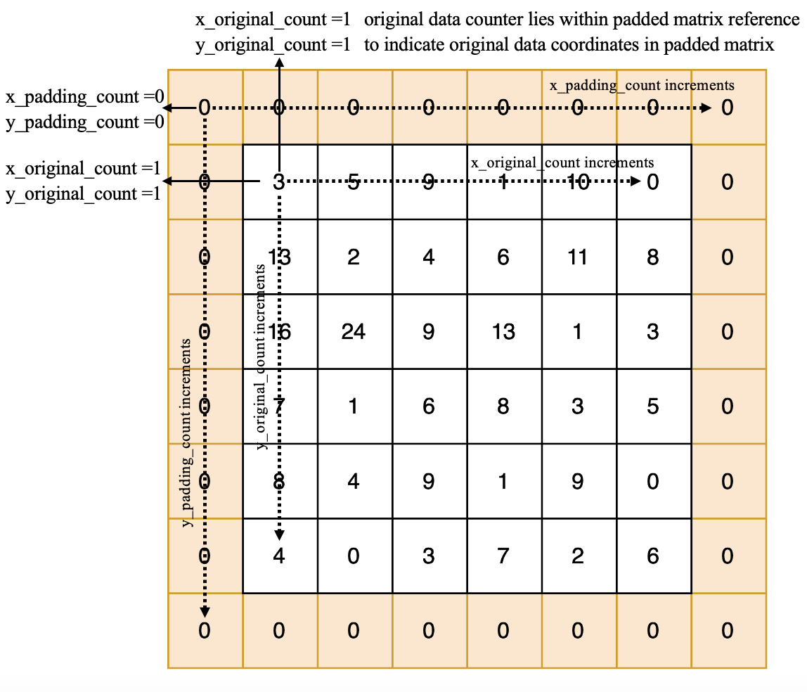

# CNN Accelerator: Hardware Methodology & Architecture

This repository contains a CNN accelerator implemented in SystemVerilog with an end-to-end automated design flow—from PyTorch model definition to synthesizable hardware—using the MASE Machine Learning compiler. The design is simulated using Verilator and verified with Cocotb.

## Table of Contents
- [Proposed Hardware Methodology](#proposed-hardware-methodology)
- [CNN Architecture Overview](#cnn-architecture-overview)
- [Padding Module](#padding-module)
- [Striding Module](#striding-module)
- [CNN Arithmetic Block](#cnn-arithmetic-block)
- [Simulation Results](#simulation-results)
- [Getting Started](#getting-started)

## Proposed Hardware Methodology

### Choice of Simulator
- **Design Implementation:** Developed in SystemVerilog.
- **Simulation:**  
  - **Verilator v5.020:** Converts SystemVerilog into a high-performance C++ simulation model.  
  - **Cocotb v1.8.0:** A Python-based testbench framework that facilitates testing in a Python environment.

### MASE Automation
- **Overview:**  
  The things we have done to enable CNN automation are listed below:
  
- **Convolutional Layers:**
  - Defined in the `INTERNAL_COMP` library using the `conv2d` operation.
  - Module `convolution_mase.sv`,`data_in_reshaper.sv`, `weight_buffer.sv`, `striding.sv`,`striding_input_buffer.sv`,`padding_mase_array.sv`,`out_buffer.sv`,`data_in_reshaper.sv`,`conv_arith_mase_array.sv` are written by our team and added to MASE.
  - The `add_hardware_metadata` pass extracts attributes such as `striding`, `padding`, and `bias` (set to `0` if not used) and converts them into SystemVerilog parameters(e.g., `STRIDE_TENSOR_SIZE_DIM_0_VALUE`, `PADDING_TENSOR_SIZE_DIM_1_VALUE`).
  - The `emit_bram_transform` stage supports four-dimensional weights by adding parameters like `WEIGHT_TENSOR_SIZE_DIM_2` and `WEIGHT_TENSOR_SIZE_DIM_3`.
  - Generates a top-level module (`top.sv`) that instantiates and correctly wires the convolution block.
  
- **Max Pooling Layers:**
  - The PyTorch layer `nn.MaxPool2d` is recognized in the `add_common_metadata` pass.
  - Mapped to the `max_pool2d` operation and integrated via the `INTERNAL_COMP` library.
  - Automatically generates the necessary hardware metadata and SystemVerilog parameters.

## CNN Architecture Overview

The accelerator processes data through the following stages:
1. **Reshaping:** Aligns input data with network requirements.
2. **Padding:** Adds a one-pixel zero border around the input image.
3. **Striding:** Extracts data patches corresponding to the convolution kernel.
4. **Convolution Arithmetic:** Performs parallel dot-product multiplications.
5. **Pooling:** Applies max pooling to the convolution outputs.

The overall architecture is illustrated below:


## Padding Module (`padding_mase_array.sv`)
- **Purpose:** Adds a one-pixel zero border around an input image.
- **Operation:**  
  - An internal state machine and two sets of counters manage the pixel flow.
  - **Padding Counters:** (`x_padding_count`, `y_padding_count`) track the output coordinates, including padded zeros.
  - **Original Data Counters:** (`x_original_count`, `y_original_count`) track the actual data coordinates.
  - The state machine transitions through several states to output:
    1. Top row zeros.
    2. Valid pixel data with side zeros.
    3. Bottom row zeros when the input frame ends.
  
- **Diagram:**  
  

## Striding Module (`striding.sv`)

### Module Architecture
- **Function:** Implements a configurable sliding window over the padded input.
- **Parameters:**  
  - Matrix dimensions: `MATRIX_ROWS`, `MATRIX_COLS`
  - Kernel dimensions: `KERNEL_ROWS`, `KERNEL_COLS`
- **Data Flow:**  
  - Data enters sequentially via a valid-ready handshake.
  - Extracted windows follow a specific order (top-left, top-right, bottom-left, bottom-right) to match the expected output block structure (e.g., a `2 × 2` matrix).

### Data Processing & Pipeline
- **FSM States:**
  1. **CAPTURE:** Buffers input until a complete window is available.
  2. **PROC_OUT:** Concurrently buffers new data and extracts windows.
  3. **FLUSH_OUT:** Completes extraction once all input data has been received.
  4. **DONE:** Indicates completion and waits for the next frame.
- **Optimization:**  
  Uses a 2D array (`frame_mem`) for buffering and leverages spatial locality to maximize data reuse and throughput.

## CNN Arithmetic Block (`conv_arith_mase_array.sv`)
- **Role:** Core component performing multiply-accumulate (MAC) operations for convolution.
- **Operation:**  
  - Managed by a finite state machine (FSM) with three states:
    - **IDLE:** Waits for valid weight and data inputs.
    - **ACCUM:** Performs sequential MAC operations over the kernel window.
    - **DONE:** Outputs the final result and awaits handshake from downstream logic.
- **Efficiency:** Optimized for parallel computation across multiple output channels.

## Pooling Module (`max_pooling_2d.sv`)
- **Role:** Implements a 2D max pooling operation on input feature    maps. The module reads incoming data from a FIFO, organizes it into a row buffer, extracts fixed-size pooling windows (e.g., 2×2), computes the maximum value within each window, and outputs the pooled results. 
- **FSM States:**
  1. **IDLE**: Waits for valid input data from the FIFO.
  2. **BUFFER**: Continuously fills the row buffer until enough rows are available.
  3. **PROCESS**: Extracts pooling windows from the row buffer and computes maximum values.
  4. **OUTPUT**: Drives the computed pooled values to the output when the output interface is ready.
- **Pool window(`pool_window.sv`):** This submodule computes the maximum value within a given pooling window. The pool window module accepts an array of signed data values. It iterates through the values to determine and output the maximum, which is then used by the main pooling module for the final pooled output.
- **Diagram:** 

  


## Getting Started
1. **Install Prerequisites:**  
   - [Verilator v5.020](https://www.veripool.org/wiki/verilator)  
   - [Cocotb v1.8.0](https://cocotb.org/)
2. **Run the code:** 
   - Change the directory to the project's labs folder:
    ```bash
     cd docs/labs
     ```
   - run the python file `CNN.ipynb`

For further details, please refer to the documentation within the repository.

---

Contributions and feedback are welcome!
